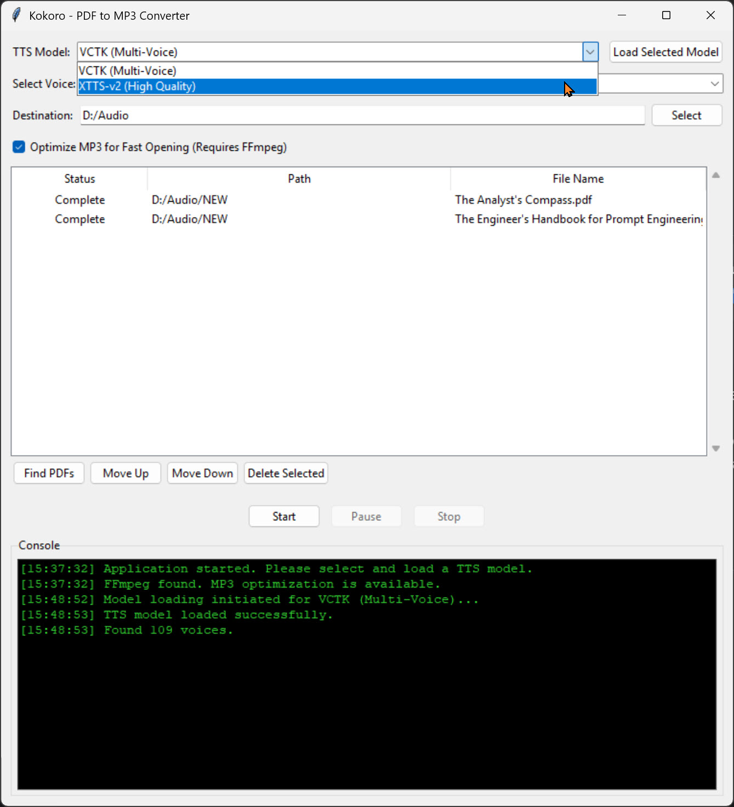

# PDF to MP3 Converter

PDF2MP3 graphical desktop application designed to batch-convert PDF files into MP3 audiobooks using advanced, locally-run Text-to-Speech (TTS) models. It provides a simple interface for managing a conversion queue and selecting from various high-quality voices.

## Overview

The application extracts text from PDF documents and uses the Coqui TTS library to generate audio. It is built with Python and Tkinter for the user interface. By running the AI models on your local machine (preferably on a CUDA-enabled GPU), it ensures privacy and avoids reliance on cloud services.

## Features

- **Batch Processing**: Convert multiple PDFs in a single session.
- **Queue Management**: Add, delete, and reorder files in the conversion queue.
- **High-Quality TTS**: Supports multiple TTS models, including:
  - **VCTK**: A multi-speaker model with many voice options.
  - **XTTS-v2**: A high-quality model that supports voice cloning from a `.wav` file.
- **Conversion Controls**: Start, pause, resume, and stop the conversion process at any time.
- **Session Persistence**: The application saves your queue and settings upon closing.
- **MP3 Optimization**: Optionally uses FFmpeg to optimize the final MP3 file for faster loading in media players.

## Setup and Installation

This application is intended for a Windows environment and relies on a specific build script (`build.bat`) to set up the environment correctly.

### Prerequisites

- **Python**: Python 3.10 is required. The build script is hardcoded to use `d:\\Python310\\python.exe`. You must edit `build.bat` if your installation path is different.
- **NVIDIA GPU**: A CUDA-compatible GPU is highly recommended for acceptable performance. The process is extremely slow on a CPU.
- **FFmpeg**: For the "Optimize MP3" feature, you must [download FFmpeg](https://ffmpeg.org/download.html) and add its `bin` directory to your system's PATH environment variable.

### Installation Steps

1.  **Clone or download the repository.**
2.  **Run the build script**: Execute `build.bat`. This script automates the entire setup process:
    - Creates a Python virtual environment in a folder named `venv`.
    - Activates the virtual environment.
    - Installs PyTorch with CUDA 12.8 support.
    - Installs all other necessary Python packages (`PyMuPDF`, `TTS`, etc.).

### Local AI Model Setup (Whisper/TTS)

The necessary TTS models are **not** included in this repository due to their size. The application will automatically download the selected model (`VCTK` or `XTTS-v2`) from the internet the first time you click **"Load Selected Model"**.

- This initial download can be large (several gigabytes) and may take a significant amount of time depending on your internet connection.
- The models are cached locally for future use.

## Usage

### Running the Application

1.  Activate the virtual environment: `.\\venv\\Scripts\\activate`
2.  Run the application script: `python kokoro_converter.py`

### Step-by-Step Guide

1.  **Select TTS Model**: Choose a model from the "TTS Model" dropdown.
2.  **Load Model**: Click the **"Load Selected Model"** button. Wait for the model to download (on first use) and load into memory. The console will indicate when it's ready. It takes a minute!
3.  **Select Voice**:
    - If using **VCTK**, choose a speaker from the "Select Voice" dropdown. 
    - If using **XTTS-v2**, click the "Select Voice File" button to provide a clear, short (6 seconds or there about) `.wav` file of the voice you want to clone.
4.  **Set Destination**: Choose the folder where your MP3 files will be saved.
5.  **Add PDFs**: Click **"Find PDFs"** and select a folder containing the PDF files you want to convert. They will be added to the queue.
6.  **Start Conversion**: Click the **"Start"** button to begin processing the queue.

## Building the Executable

The `build.bat` script can also compile the application into a standalone `kokoro.exe` file using PyInstaller.

I named it kokoro just to confuse the heck out of you! The exe file will be about 3.5GB in size so you will need fast internet and patience.

1.  Ensure you have successfully run the setup portion of the script first.
2.  Run `build.bat` again. It will skip the setup and proceed to the build step.
3.  The final executable will be located in the `dist` folder.
